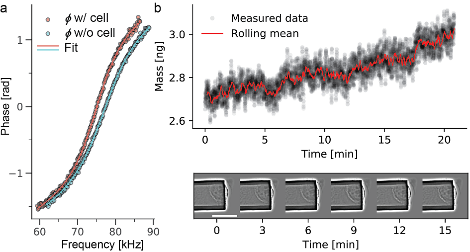

.. pyIMD documentation master file, created by
   sphinx-quickstart on Mon Jan  7 11:51:05 2019.
   You can adapt this file completely to your liking, but it should at least
   contain the root `toctree` directive.

Welcome to pyIMD's documentation!
=================================

.. image:: https://img.shields.io/badge/Made%20with-Python-brightgreen.svg
        :target: https://www.python.org/
        :alt: made-with-python

.. image:: https://img.shields.io/pypi/pyversions/pyimd.svg
        :target: https://www.python.org/
        :alt: made-with-python3.6

.. image:: https://img.shields.io/badge/platform-linux--x64%20%7C%20osx--x64%20%7C%20win--x64-lightgrey.svg
        :alt: supported-platform

.. image:: https://img.shields.io/badge/license-GPLv3-brightgreen.svg
        :target: https://git.bsse.ethz.ch/cunya/pyimd/master/LICENSE
        :alt: License

.. image:: https://readthedocs.org/projects/pyimd/badge/?version=latest
        :target: https://pyimd.readthedocs.io/en/latest/?badge=latest
        :alt: Documentation Status

    
    
    Evolution of mass over time and the corresponding microscopy images are shown for a time span of 20min.
    The mass data was acquired every 10 ms (data shown in black), overlaid in red is the rolling mean with a window of
    1000. Images taken every 3 min over the observed times span. The mammalian cell increases mass steadily..

The total mass of single cells can be accurately monitored in real time under physiological conditions with our recently
developed picobalance. It is a powerful tool to investigate crucial processes in biophysics, cell biology or medicine,
such as cell mass regulation. However, processing of the raw data can be challenging, as computation is needed to extract
the mass and long-term measurements can generate large amounts of data. Here, we introduce the software package **pyIMD**  that
automates raw data processing, particularly when investigating non-migrating cells. **pyIMD** stands for
Python inertial mass determination and is implemented using Python 3.6 and can be used as a command line tool
or as a stand-alone version including a graphical user interface. 

This documentation of **pyIMD** describes the API and provides sample data sets as well as sample scripts to
run **pyIMD** from Jupyter or the Python console. It also contains a tutorial about how **pyIMD** is used with the user
interface.

.. toctree::
   :maxdepth: 2
   :caption: Contents:

   installation
   group
   api
   authors
   license
   references

Indices and tables
==================

* :ref:`genindex`
* :ref:`modindex`
* :ref:`search`

