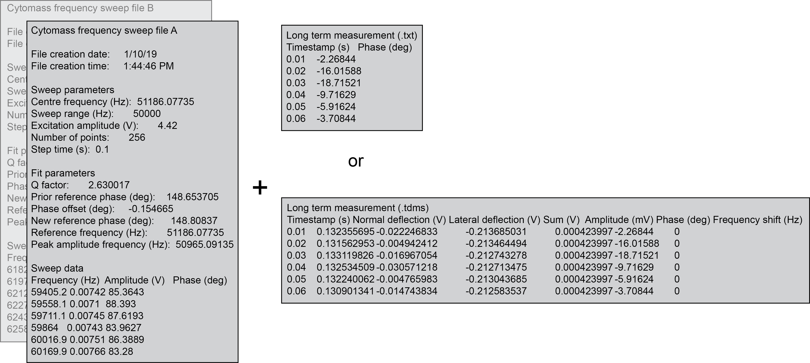
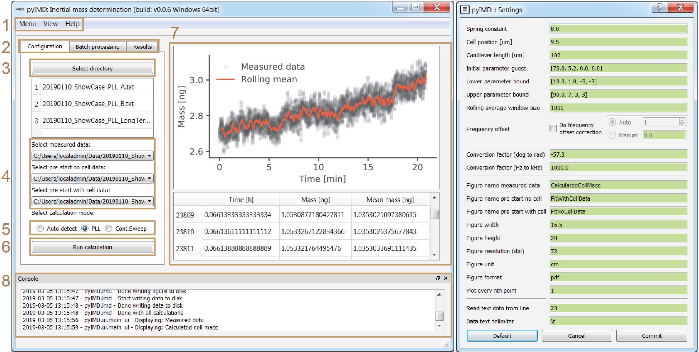
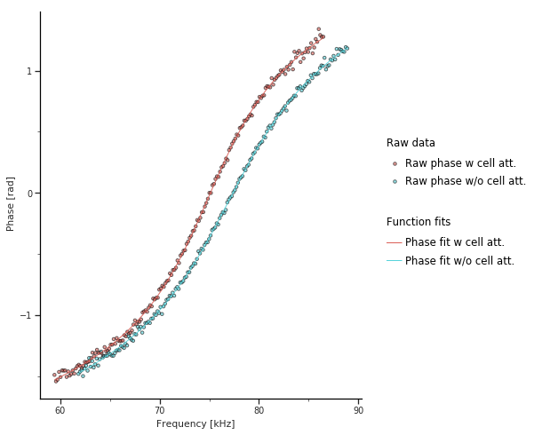
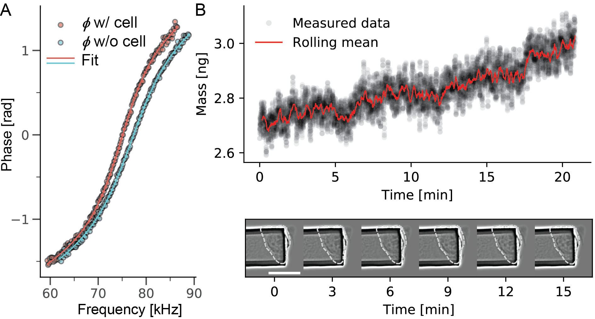

pyIMD User Interface Tutorial
=============================

Before starting, make sure pyIMD is :doc:`installed </installation>`

This tutorial provides a simple example with a test dataset, teaching step by step how to:

    - create a pyIMD project
    - calculate the mass form the measured data

First, lets have a look at the input data. The typical data set consists of 3 files: 
1) a sweep file of the cantilever
WITHOUT cell (text file with multi-line header) 2) a sweep file of the cantilever WITH cell (text file with multi-line header) 
and 3) the actual (long-term) measurement file, which is either a text file or TDMS file (lab-view specific file type). A typical
time resolution is 10 ms for the data acquisition so these files can be
quite large. **Fig. 1** visualizes the data input which can be found as example data set for download and testing.

    **Figure 1**: Data format for pyIMD

The example pyIMD script section demonstrates how a pyIMD project is created on the console:

.. code-block:: python

    from pyIMD.imd import InertialMassDetermination

    # Create the inertial mass determination object
    imd = InertialMassDetermination()

    # Create a config file for the project / experiment to analyze using default values. Note non default parameters can be
    # added as optional arguments for e.g. spring_constant = 5.
    file_path1 = "C:\\Users\\<USERNAME>\\PyIMD Showcase data\\0190110_ShowCase_PLL_B.txt"
    file_path2 = "C:\\Users\\<USERNAME>\\PyIMD Showcase data\\20190110_ShowCase_PLL_A.txt"
    file_path3 = "C:\\Users\\<USERNAME>\\PyIMD Showcase data\\20190110_ShowCase_PLL_LongTerm.txt"
    imd.create_pyimd_project(file_path1, file_path2, file_path3, '\t', 23, 'PLL', figure_width=16.5, figure_height=20,
                             initial_parameter_guess=[60.0, 2.0, 0.0, 0.0], cell_position=9.5, figure_format='pdf')

When using pyIMD through its user interface (UI) in the stand alone mode, the pyIMD project is created in exact the same way
in the background. Yet, the user does not need to take care to type the paths or arguments correctly as all the input entered
trough the UI will be validated automatically. **Fig. 2** shows the main window and the settings window of the pyIMD application.
A new pyIMD project is created by selecting the three data files required for the
calculation from a directory (3). Next, it needs to be declared which measurement each file contains
and what the measurement mode is (5). Using the menu (1), opens the settings dialog and lets you determine all
project related parameters such as the names of the output figures. After all settings are set, the mass calculation is started with (6).

.. code-block:: python

    # Run the inertial mass determination
    imd.run_inertial_mass_determination()

The console (8) logs all actions performed with the UI and indicates when all calculations are done. The results can be
viewed in the results tab (2), where as all the output figures are listed as well as the data can be inspected.

    **Figure 2**: . Through the menu bar (1) the pyIMD project can be loaded, saved, and the settings and parameter dialog
    opened (shown at the right-hand side). The help menu contains the software documentation, the quick help (also shown during startup),
    change log and information about the software dependencies and authors. The tabs (2) allow to switch between single calculation,
    batch calculation, and results. After all calculations are done the results tab is enabled and shows the latest result figures
    and data table in (7). (3) Creates a new pyIMD project while selecting at least three data files required for the calculation.
    After the files have been selected, it needs to be declared which type of data they contain, i.e. whether it is the single reference
    measurement of the cantilever without cell or the reference measurement with cell or the time resolved data (4). 
    (5) Sets the acquisition mode that was used to collect the experimental long-term data. (6) Starts the mass calculation.
    If the batch processing is selected in (2) one or multiple pyIMD project files can be loaded, which will be run sequentially
    in different threads. With the settings dialog on the right, all the required parameters needed for the calculation as well
    as the output file formats or file names are set. The user input is validated live and if a parameter of a wrong type is entered,
    the input field turns yellow to notify the user of the mistake. When the user has inserted all necessary parameters correctly and
    started the calculation, a process is reported in the info window (8), and finally the result is shown in the main window. 

The first output created by pyIMD are control figures visualizing the fit of the cantilevers phase response is shown for
the case with and without cell (**Fig. 3**). The shift towards lower frequencies can be clearly seen, when the cell is attached.
Moreover, the Q-factor changes and therefore the slope of the response curve. If the fits are not fitting the raw data
the parameter 'initial_parameter_guess', 'lower_parameter_bounds', 'upper_parameter_bounds' need to be adjusted in the
settings dialog.

    **Figure 3**: Frequency vs cantilever phase response

The analysis output by the software is shown in **Fig. 4**, the exemplary data for a mammalian cell is provided for download.
The evolution of mass vs time is shown for a time span of 20 min. The mass data was acquired every 10 ms (data shown in
black), overlaid in red is the rolling mean with a window of 1000 (adjustable parameter 'rolling_window_size'). Images
taken every 3 min  over the observed time span, we see on average a steady increase of the cell mass, the spring constant
is 8 N/m (adjustable parameter 'sprint_constant'). The position of the cell projected along the long axis of the
cantilever was 9.5 um (adjustable parameter, 'cell_position') and did not change, which is of importance for
the current use of the software.

    **Figure 4**: Evolution of mass over time

The project can either be re-run with different parameters, to i.e. improve the function fits or be saved using the menu
(**Fig. 2**, (1)).

.. code-block:: python

    # save a pyIMD project
    imd.save_pyimd_project("C:\\Users\\<USERNAME>\\PyIMD Showcase data\\pyIMDShowCaseProject.xml")

A previously saved project can be loaded again at a later time from the menu (**Fig. 2**, (1))or also from the command
line without the user interface:

.. code-block:: python

    # load a pyIMD project
    imd.load_pyimd_project("C:\\Users\\<USERNAME>\\PyIMD Showcase data\\pyIMDShowCaseProject.xml")

